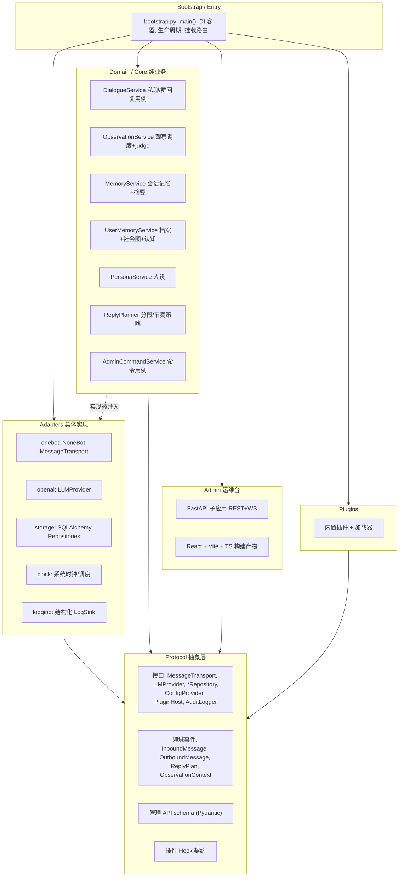
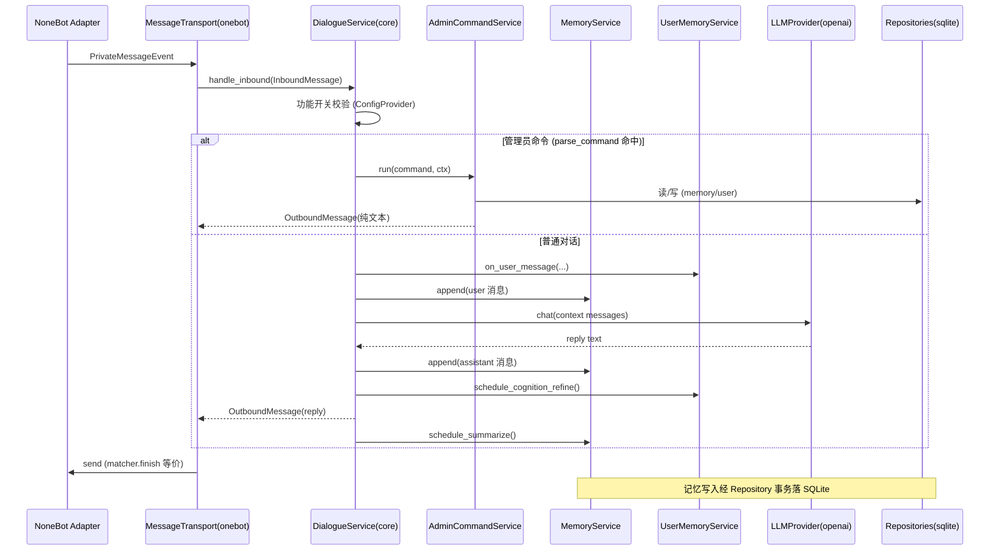
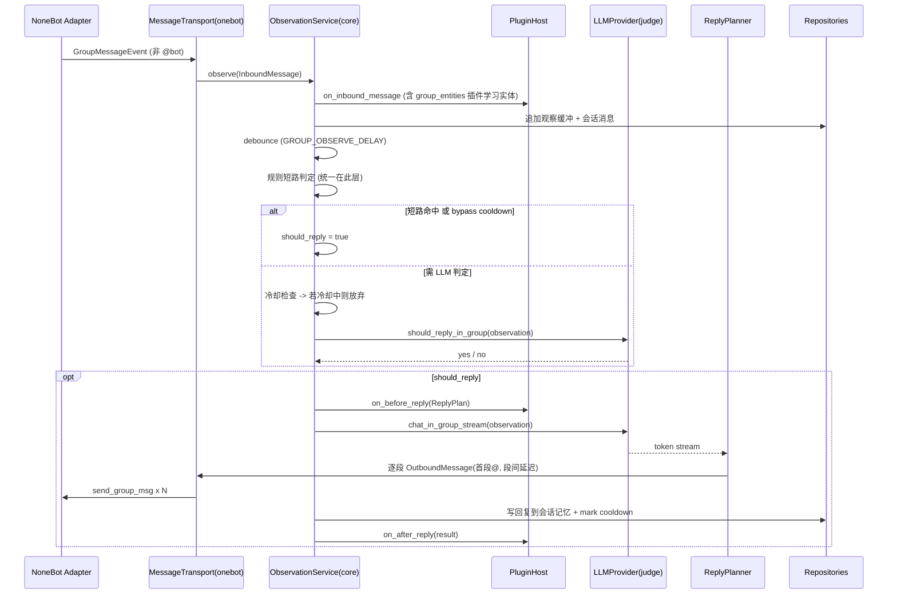
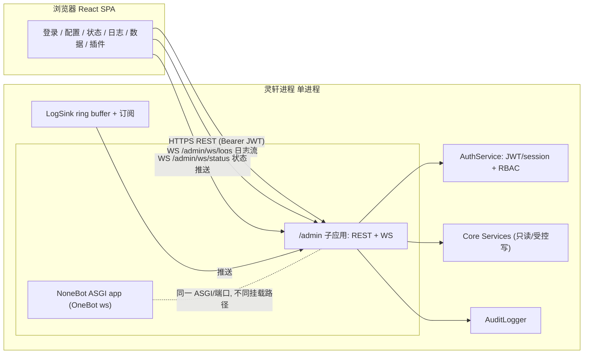
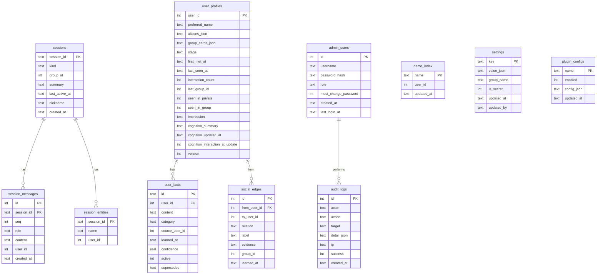
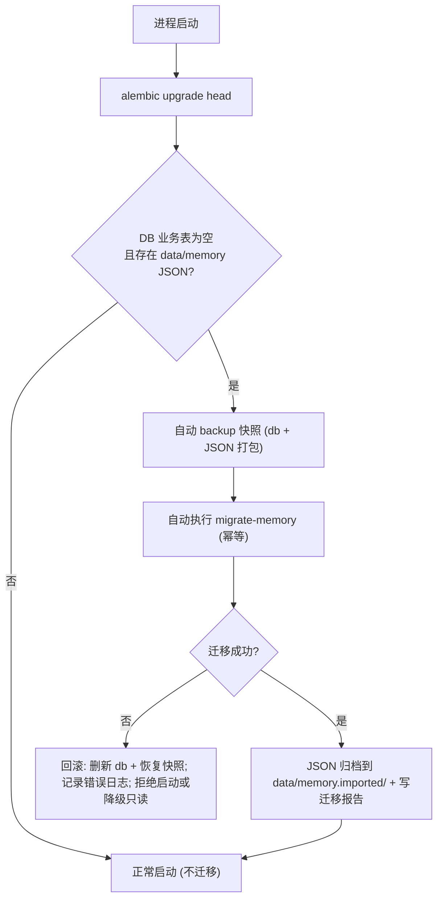
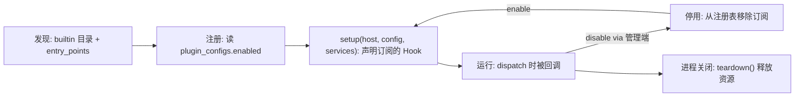

# 灵轩 v2 分层架构与分阶段迁移方案

> 本文为设计与计划文档，不含实现代码。产出依据：对 MVP 源码 `src/lingxuan/` 的逐文件探查（handlers、bot、startup、admin、config、llm、group_observer、persona、message_chunk、memory、user_memory、group_entities）以及 `pyproject.toml`、`.env.example`、`README.md`。
>
> 目标读者：项目维护者。阅读顺序建议：先读「一、执行摘要」与「十四、开放问题」，再按需展开。

---

## 一、执行摘要

灵轩 MVP 已跑通全部核心业务（私聊、群聊 @ 直回、群被动观察、三层记忆、群实体学习、可配置人设、管理员命令），但代码组织是**框架耦合的单体**：业务逻辑与 NoneBot/OneBot 类型、模块级全局配置、JSON 文件读写、进程内全局可变状态紧密缠绕，难以测试、难以热更新、无法从 Web 侧运维。

**v2 要解决的核心问题**：在**不回退任何 MVP 业务能力**的前提下，把系统重构为**四层解耦的可演进单体（modular monolith）**——Core（纯业务）/ Protocol（抽象接口与领域事件）/ Adapter（NoneBot、OpenAI、SQLite 等具体实现）/ Bootstrap（组装与入口）；同时把持久化从 JSON 文件迁移到 **SQLite + SQLAlchemy 2.0(async) + Alembic**，并新增一个 **React SPA + FastAPI 的自研 Web 运维台**与一个**同进程 Hook 插件系统**。

**整体策略**：绞杀者模式（strangler fig）+ 依赖倒置。先在不改行为的前提下把 NoneBot 收敛到 Adapter 边界、把配置与存储抽象为接口（Phase 0-1），再切换存储实现到 SQLite 并提供一次性 JSON→DB 迁移 CLI（Phase 2-3），随后叠加管理端与插件系统（Phase 4-5）。**每个 Phase 都可独立合并到 main，且合并后 MVP 功能仍然可用**。

**关键设计取向**：
- Core 只认识 `InboundMessage` / `OutboundMessage` / `ReplyPlan` / `ObservationContext` 等领域类型，**永不出现** `GroupMessageEvent`；NoneBot 保留但降级为一个 `MessageTransport` 实现。
- 配置从「`settings` 单例 + 33 个 import 时快照大写常量」双轨，收敛为单一 `ConfigProvider`，运行时值以 DB `settings` 表为准，`.env` 仅作首次 bootstrap 默认值（**向后兼容，不删除任何现有项**）。
- 存储走 Repository 抽象；JSON 仅保留「一次性导入」与「导出备份」两条路径，**禁止长期 JSON↔DB 双写**。
- 群观察的 judge 编排从「`group_observer` 规则层 + `handlers/group.py` 短路层」两处收敛到 Core 的 `ObservationService`；进程内全局 dict 收敛为有明确生命周期的运行时状态对象。

**预计工期量级**（单人、人天量级估算，含测试）：Phase 0≈2、Phase 1≈5、Phase 2≈5、Phase 3≈3、Phase 4≈8、Phase 5≈4，合计约 **27 人天**（不含前端打磨与 P2 功能详设）。可分批交付，前 3 个 Phase（≈12 人天）即可完成「分层解耦 + 数据库化」这一最有价值的核心目标。

---

## 二、现状问题分析

下表逐条回应附件「已知架构问题」，并补充探查中发现的**额外耦合点（附文件路径与行号）**。

### 2.1 逐条回应

**问题 1：handlers 与框架强耦合。**
证实且比预期更严重。`handlers/group.py`（390 行）直接 `import nonebot` 与 `from nonebot.adapters.onebot.v11 import Bot, GroupMessageEvent`，用 `nonebot.on_type(GroupMessageEvent, ...)` 注册 matcher（`handlers/group.py:51`），且 `handle_group(bot: Bot, event: GroupMessageEvent)`（`handlers/group.py:307`）一个函数内串联了 **admin / config / group_entities / group_observer / llm / memory / message_chunk / user_memory** 共 8 个模块、24+ 个观察相关符号。回复既走 `matcher.finish()`（`handlers/group.py:331`）又走显式 `bot.send_group_msg`（经 `message_chunk`）。`handlers/private.py` 同构但更简单。

**问题 2：全局配置单例。**
证实。`config.py:103` 定义 `settings = Settings.from_env()` 单例后，`config.py:106-139` 又把它一次性快照成 33 个模块级大写常量（`BOT_NAME`、`ENABLE_*`、`GROUP_*` 等）。**双轨隐患**：大写常量是 import 时刻快照，运行时改 `settings` 不会同步；而 `is_feature_enabled` / `get_runtime_config` 读的是 `settings` 本体。绝大多数业务模块 `from lingxuan.config import BOT_NAME, ENABLE_...` 直接拿常量，因此**当前无法热更新**任何配置。

**问题 3：存储无抽象。**
证实。`memory.py`、`user_memory.py` 直接用 `Path.read_text()/write_text()` + `json.loads/dumps` 读写固定路径（如 `memory.py:52/65`、`user_memory.py:259/277/287/295`）。无 Repository 接口，无事务，业务逻辑与序列化格式、裁剪策略、文件路径硬耦合。

**问题 4：LLM 层渗透。**
证实。`llm.py`（432 行）同时承担：OpenAI client 生命周期（`_get_client` LRU 单例）、prompt 拼装（`build_context_messages`）、业务编排（judge `should_reply_in_group`、摘要 `summarize_session/maybe_summarize/schedule_summarize`、群聊回复 `chat_in_group_stream`）。且 `llm.py:7` `import nonebot` 仅为拿 logger，`llm.py` 还**延迟 import** `group_observer.record_judge_result`（反向耦合）。

**问题 5：观察引擎状态内聚在模块级。**
证实。`group_observer.py` 有 7 个模块级全局 dict（`_buffers`、`_debounce_tasks`、`_observe_callbacks`、`_last_observe_len`、`_group_states`、`_group_locks`、`_user_nicknames`，见 `group_observer.py:48-54`），随进程存活、无清理 API、无生命周期边界，无法多实例、难以测试。

**问题 6：管理面分裂。**
证实。运维能力仅在 QQ 内 `/灵轩` 文本命令（`admin.py`），且**权限判断不在 admin 层**而散落在 handler 入口（`if event.user_id in BOT_ADMINS`，`handlers/group.py:322`、`handlers/private.py`）。无 Web 配置、无日志查看、无数据管理。

**问题 7：无插件扩展点。**
证实。handlers 通过 `bot.py` 副作用 import 注册，无 registry、无 Hook、无启停开关。新增功能只能改单体模块。

**问题 8：日志非结构化。**
证实。全部依赖 `nonebot.logger`（`bot/startup/llm/group_observer/user_memory/message_chunk` 均绑定），无结构化字段、无 ring buffer、无可供管理端消费的日志 API/流。

### 2.2 探查中发现的额外耦合点

1. **`message_chunk.py` 是第二个 OneBot 硬依赖点**（易被忽略）。`message_chunk.py:9` 直接 `from nonebot.adapters.onebot.v11 import Bot, MessageSegment`，并调用 `bot.send_group_msg(group_id=..., message=MessageSegment.at(user_id) + ...)`（约 `message_chunk.py:114/117`）。这意味着「流式多气泡 + 首条 @ + 段间延迟」这一核心拟真发送策略与 OneBot 协议绑死，v2 需把它拆为「Core 侧的分段/节奏策略」+「Adapter 侧的实际发送」。

2. **群聊两条回复路径取 Bot 的方式不一致**。@ 直回路径用 handler 注入的 `bot` 参数；被动观察路径在 `handlers/group.py:263` 用 `nonebot.get_bots()` 自己取 Bot。v2 统一为 `MessageTransport` 后此不一致自然消除。

3. **judge 编排跨两层**。规则短路函数分散在 `group_observer.py`（`should_skip_observe`、`is_followup_after_bot`、`is_directed_at_bot`、`is_seeking_engagement`、`should_bypass_cooldown` 等）与 `handlers/group.py::_observe_group`（额外的 `_should_shortcircuit_judge`），LLM judge 调用又在 handler 里。决策逻辑无单一归属。

4. **实体/记忆数据多处双写**。`group_entities.learn_entities_from_entry` 把昵称同时写入 `session.meta.entities`（群级，经 `memory.merge_entity`）和 `social_graph.name_index`（全局，经 `user_memory.index_name`）。v2 入库后需以外键/唯一约束表达，并统一写入事务。

5. **会话历史存在双重裁剪**。持久化侧 `save_session` 硬保留 `history[-MEMORY_WINDOW*2:]`（最多 40 条，`memory.py:63`）；摘要成功后 `trim_history_half` 再砍掉前半（`memory.py:137-141`）。v2 行表存储需明确复现或统一这两条裁剪策略。

6. **fact 是软删除**。超过 `USER_MEMORY_MAX_FACTS` 时按 `learned_at` 升序把旧 fact 置 `active=False`（`user_memory.py:269-275`），记录仍留在 JSON。identity fact 变更时旧 identity 也置 `active=False`。v2 表需保留 `active` 列，不能物理删。

7. **旧格式自动迁移逻辑内嵌在读路径**。`memory.py:34-44` 会把「纯 list 的旧 history」升级为 v2 `SessionData` 并回写。这类历史兼容逻辑在切库时需一并处理（迁移 CLI 应能吃旧格式）。

8. **`config` 无 `data_dir` 环境变量**。`memory_dir` 恒为 `data_dir/"memory"`，`data_dir` 恒为 `BASE_DIR/"data"`（`config.py`），无法通过 env 重定向。v2 引入 DB 后应补充 `DATA_ROOT`/`DB_URL` 类配置（新增项，不破坏旧项）。

---

## 三、目标架构

### 3.1 分层架构图

依赖方向严格**自上而下、单向**：Bootstrap 知道一切；Adapter 只依赖 Protocol 定义的接口；Core 只依赖 Protocol；Protocol 只依赖标准库。Core **零依赖** NoneBot / OneBot 类型 / FastAPI / 具体存储实现。



要点：
- Core 各 Service 只接收 Protocol 定义的接口实例（构造注入），不 import 任何 Adapter。
- `admin`（FastAPI 子应用）也是一种「Adapter 的对等物」——它把领域用例暴露为 HTTP/WS，但同样只依赖 Protocol + Core Service。
- `plugins` 通过 `PluginHost` 在关键节点被 Core 回调，插件本身也只面向 Protocol 编程。

### 3.2 消息处理时序图

#### 私聊一条消息



#### 群聊被动观察一条消息



### 3.3 管理端通信图（REST + WebSocket）



要点：
- NoneBot 的 ASGI app 与 `/admin` 子应用同处一个进程（`DRIVER=~fastapi` 本就是 FastAPI），但**管理端监听独立端口**（已决策，默认 `127.0.0.1:8081`，`ADMIN_HOST`/`ADMIN_PORT` 可配置），与 OneBot ws（8080）分离，便于反代与访问控制（见第十二节取舍 2）。
- 日志：Adapter 层新增 `LogSink`，写入进程内 ring buffer 并支持订阅；WS `/admin/ws/logs` 推送，支持级别过滤与关键词搜索（服务端过滤）。
- 所有写操作（改配置、重置记忆、插件启停、终端命令）经 `AuditLogger` 落 `audit_logs` 表。

---

## 四、目录结构提案

保留包名 `lingxuan`，保持 `pyproject.toml` + hatchling。重构后 `src/lingxuan/`：

```
src/lingxuan/
├── __init__.py
├── bootstrap.py            # 入口 main()：加载配置、构建 DI 容器、注册 adapter、挂载 admin、启动 NoneBot
├── container.py            # 轻量 DI 容器/工厂（手写，不引入重型框架）
│
├── protocols/              # 抽象层：仅依赖标准库 + typing
│   ├── __init__.py
│   ├── messaging.py        # MessageTransport、InboundMessage、OutboundMessage、ReplyPlan
│   ├── llm.py              # LLMProvider（chat/stream/judge）
│   ├── repositories.py     # Session/UserProfile/SocialGraph/Config/Audit/Plugin 各 Repository 接口
│   ├── config.py           # ConfigProvider（读/写/订阅）
│   ├── plugins.py          # PluginHost、HookType、PluginContext
│   ├── logging.py          # LogSink、LogRecord
│   └── clock.py            # Clock（now/sleep，便于测试）
│
├── core/                   # 领域/业务：零框架、零 IO 具体实现
│   ├── __init__.py
│   ├── models.py           # 领域模型：SessionId、Actor、ObservationContext 等
│   ├── dialogue.py         # DialogueService：私聊 & 群 @ 直回用例
│   ├── observation.py      # ObservationService：缓冲/防抖/冷却/规则短路/judge 编排
│   ├── observation_state.py# 观察运行时状态对象（取代模块级全局 dict）
│   ├── memory.py           # MemoryService：会话记忆、摘要触发与裁剪策略
│   ├── user_memory.py      # UserMemoryService：档案、facts、社会图、认知整合
│   ├── persona.py          # PersonaService：system prompt 组装
│   ├── reply_planner.py    # ReplyPlanner：分段/节奏（纯策略，产出 OutboundMessage 序列）
│   ├── prompting.py        # prompt 拼装（原 llm.build_context_messages 的纯逻辑部分）
│   └── admin_commands.py   # AdminCommandService：status/reset_memory/... 用例（原 admin.py）
│
├── adapters/               # 具体实现：依赖 protocols
│   ├── __init__.py
│   ├── onebot/
│   │   ├── transport.py    # NoneBot on_type matcher → InboundMessage；OutboundMessage → send_group_msg/finish
│   │   ├── mapping.py      # Event ↔ 领域类型 转换
│   │   └── lifecycle.py    # nonebot.init/register_adapter/on_startup/on_shutdown（原 bot.py/startup.py）
│   ├── openai/
│   │   └── provider.py     # AsyncOpenAI 实现 LLMProvider
│   ├── storage/
│   │   ├── db.py           # async engine/session（aiosqlite, WAL）
│   │   ├── orm.py          # SQLAlchemy 2.0 ORM 映射
│   │   └── repositories.py # 各 Repository 的 SQLAlchemy 实现
│   ├── logging/
│   │   └── sink.py         # 结构化 LogSink：ring buffer + 订阅 + 桥接 nonebot.logger
│   └── clock.py            # SystemClock
│
├── admin/                  # 运维台
│   ├── __init__.py
│   ├── app.py              # FastAPI 子应用（REST + WS 路由挂载）
│   ├── auth.py             # AuthService：登录、JWT/session、RBAC、首登改密
│   ├── deps.py             # 依赖注入 + 鉴权守卫
│   ├── routes/             # config/status/logs/memory/plugins/terminal/files 各路由
│   ├── ws.py               # WebSocket：日志流、状态推送
│   ├── schemas.py          # Pydantic API schema
│   └── web/                # React + Vite + TS 源码，构建产物输出到 web/dist（静态挂载）
│
├── plugins/                # 插件系统
│   ├── __init__.py
│   ├── host.py             # PluginHost：注册表 + Hook 分发
│   ├── loader.py           # 发现/加载（内置目录 + entry_points）
│   └── builtin/
│       └── group_entities.py  # 现有群实体学习改造为内置插件（on_inbound_message）
│
├── cli.py                  # lingxuan CLI：run / migrate-memory / db upgrade / admin-passwd
└── config/                 # 配置默认值与 schema（不含运行时值）
    └── defaults.py         # 全部配置项的 key、类型、默认值、分组、是否敏感（单一事实源）
```

每个目录一句话职责已随树注释给出。核心变化：`handlers/` 消失，其职责拆入 `adapters/onebot/transport.py`（协议转换）与 `core/dialogue.py`+`core/observation.py`（业务编排）；`config.py` 拆为 `protocols/config.py`（接口）+ `adapters` 里的 DB/env 实现 + `config/defaults.py`（默认值单一事实源）。

---

## 五、核心抽象接口清单

以下为方法签名草案（Python `typing.Protocol`，不含实现）。类型引用见第六节领域模型。

### 5.1 MessageTransport

```python
from typing import Protocol, AsyncIterator

class MessageTransport(Protocol):
    async def send(self, out: "OutboundMessage") -> None: ...
    async def send_stream(
        self, target: "ReplyTarget", chunks: AsyncIterator["OutboundChunk"]
    ) -> "SentResult": ...
    def start(self, on_inbound: "InboundHandler") -> None: ...
    async def resolve_self_id(self) -> int: ...
```

`InboundHandler = Callable[[InboundMessage], Awaitable[None]]`。NoneBot Adapter 在 matcher 回调里把 event 映射为 `InboundMessage` 后调用 `on_inbound`；发送侧把 `OutboundChunk` 序列翻译为 `send_group_msg`（首段 `MessageSegment.at`）或 `finish`。

### 5.2 LLMProvider

```python
class LLMProvider(Protocol):
    async def chat(
        self, messages: list["ChatMessage"], *,
        max_tokens: int = 1024, temperature: float = 0.7, timeout: float = 30.0,
    ) -> str: ...

    def chat_stream(
        self, messages: list["ChatMessage"], *,
        max_tokens: int = 1024, temperature: float = 0.7,
    ) -> AsyncIterator[str]: ...

    async def judge(
        self, prompt: str, *, timeout: float = 5.0, default: bool = False,
    ) -> bool: ...
```

对齐现状：`chat` 对应 `call_llm_raw`/`chat`，`chat_stream` 对应 `chat_stream`/`chat_in_group_stream`，`judge` 对应 `should_reply_in_group`（返回 bool，内部 yes/no 解析）。prompt 拼装移出 provider，进入 `core/prompting.py`。

### 5.3 Repositories

```python
class SessionRepository(Protocol):
    async def get(self, session_id: "SessionId") -> "Session | None": ...
    async def create(self, session_id: "SessionId", *, kind: str, group_id: int | None) -> "Session": ...
    async def append_message(self, session_id: "SessionId", msg: "StoredMessage") -> None: ...
    async def load_history(self, session_id: "SessionId", *, limit: int | None = None) -> list["StoredMessage"]: ...
    async def trim_history(self, session_id: "SessionId", *, keep_last: int) -> int: ...
    async def get_summary(self, session_id: "SessionId") -> str: ...
    async def set_summary(self, session_id: "SessionId", summary: str) -> None: ...
    async def clear(self, session_id: "SessionId") -> None: ...
    async def update_meta(self, session_id: "SessionId", **meta: object) -> None: ...
    # 群实体（原 meta.entities）
    async def merge_entity(self, session_id: "SessionId", name: str, user_id: int) -> None: ...
    async def get_entities(self, session_id: "SessionId") -> dict[str, int]: ...

class UserProfileRepository(Protocol):
    async def get(self, user_id: int) -> "UserProfile | None": ...
    async def upsert(self, profile: "UserProfile") -> None: ...
    async def add_fact(self, user_id: int, fact: "UserFact") -> None: ...
    async def list_active_facts(self, user_id: int, *, limit: int | None = None) -> list["UserFact"]: ...
    async def deactivate_facts(self, user_id: int, fact_ids: list[str]) -> None: ...
    async def list_user_ids(self) -> list[int]: ...
    async def delete(self, user_id: int) -> bool: ...
    async def delete_all(self) -> int: ...

class SocialGraphRepository(Protocol):
    async def add_edge(self, edge: "SocialEdge") -> None: ...   # 幂等：唯一约束去重
    async def index_name(self, name: str, user_id: int) -> None: ...
    async def resolve_name(self, name: str) -> int | None: ...
    async def edges_of(self, user_id: int) -> list["SocialEdge"]: ...
    async def clear(self) -> None: ...
```

### 5.4 ConfigProvider

```python
class ConfigProvider(Protocol):
    def get(self, key: str) -> object: ...
    def get_typed(self, key: str, cast: type["T"]) -> "T": ...
    async def set(self, key: str, value: object, *, actor: str) -> None: ...   # 落 DB + 审计
    async def get_all(self, *, mask_secrets: bool = True) -> dict[str, object]: ...
    def subscribe(self, callback: "Callable[[str, object], None]") -> "Unsubscribe": ...
```

解析优先级：DB `settings` 表 > `.env` > `config/defaults.py`。`subscribe` 支持热更新（`on_config_change` Hook 与内存缓存刷新）。

### 5.5 PluginHost

```python
class PluginHost(Protocol):
    def register(self, plugin: "Plugin") -> None: ...
    def enable(self, name: str) -> None: ...
    def disable(self, name: str) -> None: ...
    def registry(self) -> list["PluginInfo"]: ...
    async def dispatch(self, hook: "HookType", ctx: "PluginContext") -> "PluginContext": ...
```

### 5.6 AuditLogger

```python
class AuditLogger(Protocol):
    async def record(
        self, *, actor: str, action: str, target: str = "",
        detail: dict | None = None, ip: str = "", success: bool = True,
    ) -> None: ...
    async def query(
        self, *, actor: str | None = None, action: str | None = None,
        limit: int = 100, before_id: int | None = None,
    ) -> list["AuditEntry"]: ...
```

### 5.7 LogSink 与 Clock

```python
class LogSink(Protocol):
    def emit(self, record: "LogRecord") -> None: ...
    def tail(self, *, limit: int = 200, level: str | None = None, keyword: str = "") -> list["LogRecord"]: ...
    def subscribe(self, callback: "Callable[[LogRecord], None]") -> "Unsubscribe": ...

class Clock(Protocol):
    def now(self) -> "datetime": ...
    def monotonic(self) -> float: ...
    async def sleep(self, seconds: float) -> None: ...
```

`Clock` 让观察引擎的防抖/冷却/延迟可在测试中被虚拟时钟驱动。

---

## 六、领域模型草案

均为 `@dataclass`（或 `frozen=True` 值对象），位于 `core/models.py` 与 `protocols/messaging.py`，**不含任何 NoneBot/OneBot 类型**。

```python
@dataclass(frozen=True)
class SessionId:
    kind: Literal["private", "group"]
    peer_id: int                      # private=user_id, group=group_id
    # 序列化为字符串 "private_{id}" / "group_{id}" 以兼容旧路径与迁移

@dataclass(frozen=True)
class Actor:
    user_id: int
    nickname: str = ""
    is_admin: bool = False
    is_self: bool = False

@dataclass
class InboundMessage:
    session_id: SessionId
    actor: Actor
    text: str                         # 已去除 @ 段的纯文本
    raw_text: str = ""
    at_bot: bool = False
    reply_to_bot: bool = False
    at_user_ids: list[int] = field(default_factory=list)
    group_id: int | None = None
    received_at: datetime = ...
    # 命令解析结果（若为管理员命令）
    command: tuple[str, list[str]] | None = None

@dataclass(frozen=True)
class ReplyTarget:
    session_id: SessionId
    at_user_id: int | None = None     # 群聊首段 @ 目标

@dataclass
class OutboundChunk:
    text: str
    at_user_id: int | None = None     # 仅首段非空
    delay_before: float = 0.0         # 段间延迟（由 ReplyPlanner 决定）

@dataclass
class OutboundMessage:
    target: ReplyTarget
    chunks: list[OutboundChunk]       # 单段即普通回复；多段即拟真多气泡

@dataclass
class ReplyPlan:
    should_reply: bool
    reason: str = ""                  # shortcircuit / judge_yes / cooldown / disabled ...
    stream: bool = True
    observation_text: str = ""
    primary_user_id: int | None = None

@dataclass
class ObservationContext:
    session_id: SessionId
    group_id: int
    buffer: list["ObservationEntry"] # 观察缓冲快照
    last_bot_reply_at: float = 0.0
    cooldown_until: float = 0.0
    self_id: int = 0

@dataclass
class ObservationEntry:              # 对齐现有 group_observer.ObservationEntry
    user_id: int
    nickname: str
    text: str
    at_bot: bool = False
    reply_to_bot: bool = False
    at_user_ids: list[int] = field(default_factory=list)
    is_bot: bool = False
    ts: float = ...

@dataclass
class ChatMessage:
    role: Literal["system", "user", "assistant"]
    content: str

@dataclass
class StoredMessage:
    role: str
    content: str
    user_id: int | None = None
    seq: int = 0
    created_at: datetime = ...
```

`ReplyPlanner` 输入 `(ReplyPlan, token 流或整段文本)`，输出 `list[OutboundChunk]`（复用现有 `split_chunks`/`_take_emit_chunk` 的纯算法，去掉 `Bot` 依赖），由 `MessageTransport.send_stream` 落地。

---

## 七、管理 API 草案

统一前缀 `/admin/api`，静态 SPA 挂在 `/admin`。认证**已决策：JWT**（`Authorization: Bearer <access_token>`，短时效 access + 刷新 token；前后端分离友好，管理端独立端口部署）。权限列 `R`=readonly 可访问，`A`=仅 admin。

> 认证载体决策说明：采用 JWT 而非 session cookie，配合管理端独立端口（见第十四节 Q2/Q3）。access token 短时效（如 15 分钟）+ refresh token（如 7 天，可存 DB 以支持吊销）；登录返回二者，前端存于内存/`localStorage`（注意 XSS 面，见第十节）。因走 Bearer header，天然免 CSRF。

### 7.1 REST 路由表

| 方法 | 路径 | 用途 | 权限 | 优先级 |
|------|------|------|------|--------|
| POST | `/admin/api/auth/login` | 登录，返回 token | 公开 | P0 |
| POST | `/admin/api/auth/logout` | 注销 | R | P0 |
| POST | `/admin/api/auth/change-password` | 改密（首登强制） | R | P0 |
| GET | `/admin/api/auth/me` | 当前用户与角色 | R | P0 |
| GET | `/admin/api/config` | 读全部配置（敏感项脱敏） | R | P0 |
| GET | `/admin/api/config/schema` | 配置项 schema（分组/类型/默认/是否敏感） | R | P0 |
| PUT | `/admin/api/config` | 批量更新配置（落 DB + 审计 + 可选热加载） | A | P0 |
| GET | `/admin/api/status` | Bot 连接、LLM 可达、功能开关、记忆统计 | R | P0 |
| POST | `/admin/api/status/llm-check` | 主动探测 LLM 可达性 | R | P0 |
| GET | `/admin/api/logs` | 历史日志分页（级别/关键词过滤） | R | P0 |
| GET | `/admin/api/sessions` | 会话列表（分页） | R | P1 |
| GET | `/admin/api/sessions/{id}/messages` | 会话历史分页 | R | P1 |
| GET | `/admin/api/sessions/{id}/summary` | 会话摘要 | R | P1 |
| DELETE | `/admin/api/sessions/{id}` | 重置某会话记忆 | A | P1 |
| GET | `/admin/api/users` | 用户档案列表 | R | P1 |
| GET | `/admin/api/users/{uid}` | 单用户档案 + facts | R | P1 |
| DELETE | `/admin/api/users/{uid}` | 清空某用户档案 | A | P1 |
| DELETE | `/admin/api/users` | 清空全部用户档案 | A | P1 |
| GET | `/admin/api/social-graph` | 社会关系图（边 + name_index） | R | P1 |
| DELETE | `/admin/api/social-graph` | 清空社会关系图 | A | P1 |
| GET | `/admin/api/export` | 导出全库为 JSON/SQL 备份 | A | P1 |
| POST | `/admin/api/import` | 从 JSON 备份导入（确认参数） | A | P1 |
| GET | `/admin/api/plugins` | 插件列表 + Hook 注册表 | R | P1 |
| PUT | `/admin/api/plugins/{name}` | 启用/禁用/配置 | A | P1 |
| GET | `/admin/api/audit` | 审计日志分页 | A | P1 |
| POST | `/admin/api/terminal/exec` | 白名单命令执行（全量审计） | A | P2 |
| GET | `/admin/api/files` | `DATA_ROOT` 沙箱内列目录 | A | P2 |
| GET | `/admin/api/files/download` | 下载（防 `..` 穿越） | A | P2 |
| POST | `/admin/api/files/upload` | 上传（确认 + 沙箱） | A | P2 |
| DELETE | `/admin/api/files` | 删除（确认 + 沙箱） | A | P2 |

REST 路由与现有 admin 命令的语义对齐：`DELETE /sessions/{id}` ↔ `reset_memory`；`DELETE /users` ↔ `reset_user_memory all`；`DELETE /social-graph` ↔ `reset_user_memory graph`；`GET /users/{uid}` ↔ `user_memory <QQ>`；`GET /status` ↔ `status`。

### 7.2 WebSocket 事件表

| 端点 | 事件名 | 方向 | payload | 用途 | 优先级 |
|------|--------|------|---------|------|--------|
| `/admin/ws/logs` | `log` | S→C | `{ts, level, logger, msg, extra}` | 实时日志 tail | P0 |
| `/admin/ws/logs` | `filter` | C→S | `{level?, keyword?}` | 动态调整过滤 | P0 |
| `/admin/ws/status` | `status` | S→C | `{bot_online, llm_ok, features, memory_stats, observe_states}` | 状态周期推送 | P0 |
| `/admin/ws/status` | `config_changed` | S→C | `{key, value_masked}` | 配置热更新广播 | P0 |
| `/admin/ws/terminal` | `stdout`/`stderr`/`exit` | S→C | `{data}` / `{code}` | 受限终端输出 | P2 |
| `/admin/ws/terminal` | `input` | C→S | `{command}` | 白名单命令输入 | P2 |

所有 WS 连接建立时校验 token；无效或过期立即关闭。

### 7.3 与优先级的对应关系

- **P0**（登录鉴权、运行时配置、服务状态、结构化日志）：`auth/*`、`config`、`status`、`logs` REST + `/ws/logs`、`/ws/status`。这是管理端 MVP，Phase 4 首批交付。
- **P1**（记忆/数据管理、插件管理）：`sessions/*`、`users/*`、`social-graph`、`export/import`、`plugins/*`、`audit`。Phase 4 次批 / Phase 5。
- **P2**（受限终端、文件管理）：`terminal/*`、`files/*` + `/ws/terminal`。仅预留接口与安全边界，不在本轮详设实现（见第十二节风险）。

---

## 八、数据模型

引擎 **SQLite**（`data/lingxuan.db`，WAL 模式），驱动 `aiosqlite`，ORM **SQLAlchemy 2.0 async**，迁移 **Alembic**。时间统一存 ISO8601 UTC 文本（对齐现状），或 SQLite `TEXT`；布尔用 `INTEGER 0/1`。

### 8.1 ER 图



### 8.2 SQLite 表结构（字段/类型/索引/约束）

**sessions**（对齐 `SessionData` 根 + `meta` 常用键，`meta` 中开放键降级为具名列）
- `session_id TEXT PK`（`"private_{uid}"`/`"group_{gid}"`，兼容旧文件名）
- `kind TEXT NOT NULL`（`private`/`group`）、`group_id INTEGER NULL`
- `summary TEXT NOT NULL DEFAULT ''`、`nickname TEXT DEFAULT ''`
- `last_active_at TEXT`、`created_at TEXT NOT NULL`
- 说明：`meta.entities` 拆到 `session_entities`；其余罕用 meta 键如需保留可加 `meta_json TEXT`（论证：多数 meta 键已具名，故默认不设 JSON 兜底列，若迁移发现未知键则写入可选 `meta_json`）。

**session_messages**（对齐 `history[]`，行表，便于分页与裁剪）
- `id INTEGER PK AUTOINCREMENT`、`session_id TEXT NOT NULL REFERENCES sessions(session_id) ON DELETE CASCADE`
- `seq INTEGER NOT NULL`（会话内自增序，保序）、`role TEXT NOT NULL`、`content TEXT NOT NULL`
- `user_id INTEGER NULL`（仅群 user 消息）、`created_at TEXT NOT NULL`
- 索引：`UNIQUE(session_id, seq)`；`INDEX(session_id, id)`（按会话拉最新 N 条）

**session_entities**（对齐 `meta.entities`：昵称→QQ）
- `session_id TEXT NOT NULL REFERENCES sessions ON DELETE CASCADE`、`name TEXT NOT NULL`、`user_id INTEGER NOT NULL`
- 约束：`PRIMARY KEY(session_id, name)`

**user_profiles**（对齐 `UserProfile` 扁平化：identity/relationship/cognition 内联为列，列表用 JSON 列）
- `user_id INTEGER PK`、`preferred_name TEXT DEFAULT ''`
- `aliases_json TEXT DEFAULT '[]'`、`group_cards_json TEXT DEFAULT '{}'`
- `stage TEXT DEFAULT 'stranger'`、`first_met_at TEXT`、`last_seen_at TEXT`
- `interaction_count INTEGER DEFAULT 0`、`last_group_id INTEGER NULL`
- `seen_in_private INTEGER DEFAULT 0`、`seen_in_group INTEGER DEFAULT 0`
- `impression TEXT DEFAULT ''`
- `cognition_summary TEXT DEFAULT ''`、`cognition_updated_at TEXT`、`cognition_interaction_at_update INTEGER DEFAULT 0`
- `version INTEGER DEFAULT 2`
- 论证：`aliases`/`group_cards` 是小型集合且几乎总是整体读写，JSON 列比拆表更简单且不影响查询能力。

**user_facts**（对齐 `facts[]`，独立行表，保留软删除）
- `id TEXT PK`（8 位 hex，沿用现有 id）、`user_id INTEGER NOT NULL REFERENCES user_profiles ON DELETE CASCADE`
- `content TEXT NOT NULL`、`category TEXT DEFAULT 'general'`、`source_user_id INTEGER DEFAULT 0`
- `learned_at TEXT NOT NULL`、`confidence REAL DEFAULT 1.0`、`active INTEGER DEFAULT 1`、`supersedes TEXT NULL`
- 索引：`INDEX(user_id, active, learned_at)`（复现截断按 learned_at + 只取 active）
- 去重：应用层保证 active 且 content 相同不新增（对齐现状 `add_fact`）

**social_edges**（对齐 `SocialGraph.edges[]`）
- `id INTEGER PK AUTOINCREMENT`、`from_user_id INTEGER NOT NULL`、`to_user_id INTEGER NOT NULL`
- `relation TEXT NOT NULL`、`label TEXT DEFAULT ''`、`evidence TEXT DEFAULT ''`、`group_id INTEGER NULL`、`learned_at TEXT NOT NULL`
- 约束：`UNIQUE(from_user_id, to_user_id, relation, label)`（对齐现有四元组去重）
- 索引：`INDEX(from_user_id)`、`INDEX(to_user_id)`

**name_index**（对齐 `SocialGraph.name_index`：全局称呼→QQ）
- `name TEXT PK`、`user_id INTEGER NOT NULL`、`updated_at TEXT`

**settings**（取代 `.env` 运行时读取）
- `key TEXT PK`、`value_json TEXT NOT NULL`、`group_name TEXT`、`is_secret INTEGER DEFAULT 0`、`updated_at TEXT`、`updated_by TEXT`
- 首次启动从 `.env` + `config/defaults.py` 播种；此后以本表为准。

**admin_users**
- `id INTEGER PK`、`username TEXT UNIQUE NOT NULL`、`password_hash TEXT NOT NULL`（argon2/bcrypt）
- `role TEXT NOT NULL DEFAULT 'admin'`（`admin`/`readonly`）、`must_change_password INTEGER DEFAULT 1`
- `created_at TEXT`、`last_login_at TEXT`

**audit_logs**
- `id INTEGER PK`、`actor TEXT`、`action TEXT`、`target TEXT`、`detail_json TEXT`、`ip TEXT`、`success INTEGER`、`created_at TEXT`
- 索引：`INDEX(created_at)`、`INDEX(actor)`

**plugin_configs**
- `name TEXT PK`、`enabled INTEGER DEFAULT 1`、`config_json TEXT DEFAULT '{}'`、`updated_at TEXT`

**软删除策略**：仅 `user_facts.active` 使用软删除（业务必需，对齐现状）。其余表用物理删除 + `ON DELETE CASCADE`（会话删除连带消息/实体）。审计日志只增不删。

### 8.3 大表分页与 memory_window 裁剪

- **按会话拉 history**：`session_messages` 用 `WHERE session_id=? ORDER BY id DESC LIMIT ?`（群聊 `GROUP_CHAT_CONTEXT=6`，私聊全量受裁剪上限约束），再反转为时间正序。
- **裁剪策略复现现状两条**：
  1. 持久化硬上限：写入后若某会话消息数 > `MEMORY_WINDOW*2`（40），删除最旧的多余行（`DELETE ... WHERE session_id=? AND id NOT IN (SELECT id ... ORDER BY id DESC LIMIT 40)`）。
  2. 摘要后减半：摘要成功后 `SessionRepository.trim_history(keep_last=count//2)`。
- **分页**：管理端 `GET /sessions/{id}/messages` 用 keyset 分页（`id < before_id LIMIT n`），避免 OFFSET 深翻页。

### 8.4 事务边界

- **一次消息处理**：`append user 消息 → (LLM) → append assistant 消息` 中，两次 append 可各自独立提交（现状即分步落盘）；但**记忆抽取 + 用户档案更新 + 社会边写入**（原 `learn_entities_from_entry` 链）应在**同一事务**内提交，避免 name_index 与 edges 不一致。
- **配置更新**：`settings` 写入 + `audit_logs` 写入同一事务。
- **连接管理**：单进程 async，使用单一 `async_engine` + `async_sessionmaker`；开启 `PRAGMA journal_mode=WAL`、`PRAGMA synchronous=NORMAL`、`PRAGMA foreign_keys=ON`、`busy_timeout`。SQLite 写串行，观察引擎的群级 lock 仍在 Core 保留以避免同群并发回复。

### 8.5 Alembic 迁移版本策略

- `alembic/` 目录 + `alembic.ini`；`env.py` 从 `ConfigProvider`/`.env` 读 `DB_URL`（默认 `sqlite+aiosqlite:///data/lingxuan.db`）。
- **初始 migration `0001_init`**：建上述全部表 + 索引 + 约束。
- 后续 schema 变更一律新增 revision，禁止手改已发布 migration。
- CLI 封装：`lingxuan db upgrade`（= `alembic upgrade head`）、`lingxuan db revision -m "..."`。
- **已决策：启动时自动迁移**。进程启动时自动执行 `alembic upgrade head`（schema 迁移），并在**首次启动**（DB 为空且检测到旧 `data/memory` JSON）时自动触发一次 `migrate-memory` 数据导入。由配置开关 `AUTO_MIGRATE`（默认 `true`）控制，可关闭改为纯手动 CLI。详见 8.6 的自动迁移流程与安全护栏。

### 8.6 MVP JSON → DB 一次性迁移

CLI：`lingxuan migrate-memory [--dry-run] [--source data/memory] [--report report.json]`

- **幂等**：以主键/唯一约束 upsert（`session_id`、`user_id`、`fact.id`、`(from,to,relation,label)`、`name`）；重复运行不产生重复行。
- **dry-run**：只扫描与校验，输出将写入的行数统计与冲突/异常清单，不触碰 DB。
- **吃旧格式**：兼容 `memory.py` 中「纯 list 的旧 history」自动升级逻辑（迁移器内置同款升级）。
- **迁移报告**：JSON，含每个数据域计数（sessions/messages/entities/profiles/facts/edges/names）、跳过项与原因、耗时。
- **回滚（非双写）**：迁移前先 `lingxuan backup`（复制 `lingxuan.db` 快照 + 打包 `data/memory` 原 JSON）。失败则删除新 db 文件、恢复快照即可；原 JSON 全程只读，不被删除。迁移成功并验证后，JSON 目录可归档到 `data/memory.imported/`（不删除，供人工核对）。
- **顺序**：sessions → session_messages → session_entities → user_profiles → user_facts → social_edges → name_index（尊重外键）。

**启动自动迁移流程（已决策）**：`AUTO_MIGRATE=true`（默认）时，`bootstrap` 在 `alembic upgrade head` 之后执行下述判定：



安全护栏：
- **幂等前置判定**：仅当「DB 业务表为空」时才自动导入，避免对已有数据重复/误迁移；DB 非空则跳过自动导入（此后新增数据一律走 DB，JSON 不再是事实源）。
- **自动 backup**：自动迁移前强制快照，失败可一键恢复（非双写）。
- **可关闭**：`AUTO_MIGRATE=false` 时启动只做 `upgrade head`，数据导入交由人工 `lingxuan migrate-memory`（适合需人工核对的谨慎场景）。
- **失败处理**：自动迁移失败即回滚快照并中止启动（或按配置降级为只读并告警），绝不带半迁移状态对外服务。

### 8.7 关键查询示例

```sql
-- 按 session 拉最近 N 条 history（群聊 N=GROUP_CHAT_CONTEXT）
SELECT role, content, user_id
FROM session_messages
WHERE session_id = :sid
ORDER BY id DESC
LIMIT :n;            -- 应用层再反转为正序

-- 按 user 拉 active facts（用于 prompt 注入，最多 MAX_FACTS）
SELECT id, content, category, learned_at
FROM user_facts
WHERE user_id = :uid AND active = 1
ORDER BY learned_at DESC
LIMIT :max_facts;

-- 社会关系图：解析称呼 → QQ
SELECT user_id FROM name_index WHERE name = :name;

-- 社会关系图：某人对外的介绍关系（一跳遍历）
SELECT to_user_id, relation, label, evidence, group_id
FROM social_edges
WHERE from_user_id = :uid;

-- 记忆统计（管理端 status）
SELECT
  (SELECT COUNT(*) FROM sessions)                 AS session_count,
  (SELECT COUNT(*) FROM session_messages)         AS message_count,
  (SELECT COUNT(*) FROM user_profiles)            AS user_count,
  (SELECT COUNT(*) FROM user_facts WHERE active=1) AS active_fact_count,
  (SELECT COUNT(*) FROM social_edges)             AS edge_count;
```

---

## 九、插件系统设计

首期务实：**同进程、无沙箱**的内置 Hook 注册表；支持从内置目录与 Python `entry_points` 发现插件。**明确记录安全风险**（见第十节与第十二节）。

### 9.1 Hook 清单与调用时机

| Hook | 触发时机 | 可修改 | 典型用途 |
|------|----------|--------|----------|
| `on_inbound_message` | 收到 InboundMessage、进入业务前 | 可标记忽略/改写上下文 | 实体学习、敏感词、统计 |
| `on_before_reply` | 决定回复后、调用 LLM 前 | 可改 ReplyPlan / prompt | 注入额外上下文、限流 |
| `on_after_reply` | 回复发送完成后 | 只读结果 | 记录、外部通知 |
| `on_memory_extract` | 记忆抽取产出 facts/edges 后 | 可增删候选 | 自定义抽取规则 |
| `on_config_change` | 配置项变更后 | 只读 | 缓存刷新、副作用 |

调用点在 Core：`ObservationService`/`DialogueService` 在对应节点 `await plugin_host.dispatch(hook, ctx)`。`PluginContext` 携带该 Hook 相关的领域对象（不可见 NoneBot 类型），插件通过修改 ctx 字段影响后续流程（仅 `on_inbound_message`/`on_before_reply`/`on_memory_extract` 允许修改）。

### 9.2 插件生命周期



- 插件形态：实现一个约定接口的对象/模块，暴露 `name`、`version`、`setup(host, config, services)`、可选 `teardown()`。
- `setup` 中通过 `host.subscribe(HookType.on_inbound_message, handler)` 声明订阅。
- 启停：管理端写 `plugin_configs.enabled`；`PluginHost.enable/disable` 动态增删订阅（无需重启）。

### 9.3 配置 schema 约定

- 每插件在 `plugin_configs.config_json` 存独立 JSON 配置段。
- 插件可声明 `config_schema`（JSON Schema 或 Pydantic model），管理端据此渲染表单并校验。
- 配置变更走 `ConfigProvider` 同款审计与 `on_config_change` 通知。

### 9.4 示例：将 `group_entities` 抽为内置插件

现状 `group_entities.learn_entities_from_entry(session_id, group_id, entry)` 在群 handler 内被同步调用，内部又调 `memory.merge_entity` + `user_memory.index_name/sync_entity_to_graph/apply_rule_extraction`。改造为内置插件：

- 位置：`plugins/builtin/group_entities.py`，订阅 `on_inbound_message`。
- `setup(host, config, services)`：拿到 `services.session_repo` / `services.user_memory` 引用。
- handler 签名（示意）：

```python
async def on_inbound(ctx: PluginContext) -> PluginContext:
    msg = ctx.inbound                      # InboundMessage（领域类型）
    if msg.session_id.kind != "group":
        return ctx
    await entities_service.learn(          # 内部走 Repository，同一事务
        session_id=msg.session_id,
        group_id=msg.group_id,
        actor=msg.actor,
        text=msg.text,
        at_user_ids=msg.at_user_ids,
    )
    return ctx
```

- 收益：群实体学习从 Core 主流程解耦，可在管理端一键关闭；其读写全部经 Repository（不再直接碰 JSON/`session.meta`）；`sync_entity_to_graph` 的「session 级 + 全局图」双写收敛为一次事务。

---

## 十、安全设计摘要（可执行检查清单）

按附件第六节表格展开为落地检查项。

**网络**
- [ ] 管理端默认绑定 `127.0.0.1`；`ADMIN_HOST`/`ADMIN_PORT` 可配置，非本机绑定需显式开启并告警。
- [ ] 生产部署文档明确要求反向代理 + TLS（Caddy/Nginx）；应用层不自签 TLS。

**认证**
- [ ] 首次启动生成一次性 bootstrap token（打印到控制台/写入受限文件），首登强制改密（`must_change_password`）。
- [ ] 密码用 argon2/bcrypt 存 hash，禁止明文；登录失败限速 + 账号锁定阈值。
- [ ] 已决策 JWT：access token 短时效（如 15 分钟）+ refresh token（存 DB 以支持吊销）；退出即吊销 refresh token。
- [ ] API Key、密码等敏感项在 `GET /config` 一律脱敏（复用现有 `mask_api_key` 思路）。

**授权（RBAC）**
- [ ] 至少 `admin` / `readonly` 两角色；写操作与危险读（审计/终端/文件）仅 `admin`。
- [ ] 路由级依赖守卫统一校验角色，禁止在前端做唯一权限控制。

**受限终端（P2，仅预留）**
- [ ] 禁止任意 shell；仅白名单命令或只读 PTY；本机 admin only。
- [ ] 每次执行写 `audit_logs`（命令、参数、输出摘要、结果）。

**文件 API（P2，仅预留）**
- [ ] 所有路径 `os.path.realpath` 归一后必须在 `DATA_ROOT` 内，拒绝 `..` 穿越与符号链接逃逸。
- [ ] 上传/删除需二次确认参数；限制大小与类型；操作写审计。

**CSRF / XSS**
- [ ] 已决策 JWT + Bearer header，天然免 CSRF（不依赖 cookie 自动携带）。
- [ ] JWT 存储的 XSS 面：token 存于内存/`localStorage`，必须严格防 XSS——后端对所有输出做 JSON 编码；前端不 `dangerouslySetInnerHTML` 未净化内容；日志/数据展示等富文本一律转义。
- [ ] access token 短时效（如 15 分钟）+ refresh token 可吊销（存 DB），降低 token 泄露影响面。

**密钥存储**
- [ ] 密钥优先来自环境变量；写入 DB 的敏感配置 at-rest 加密（对称密钥来自 env `SECRET_KEY`，不入库）。
- [ ] `SECRET_KEY` 缺失时管理端拒绝启动或降级为只读并告警。

**LLM 数据隐私**
- [ ] 文档明确进入 prompt 的记忆字段：会话 history、`summary`、用户 `impression`/`cognition.summary`/active facts、群实体、社会关系 brief（对齐现有 `build_context_messages` 与 `format_user_context_for_prompt`）。
- [ ] 管理端提供「导出/清空我的数据」入口（对齐 admin 重置命令）。

---

## 十一、分阶段迁移计划

原则：每个 Phase 可独立合并到 main；每个 Phase 结束后 MVP 全部功能仍可用；采用绞杀者模式逐步替换，不搞大爆炸重写。工作量为单人估算（人天）。

| 阶段 | 目标 | 交付物 | 风险 | 回滚策略 | 工作量 |
|------|------|--------|------|----------|--------|
| **Phase 0** | 搭骨架，不改行为 | 新增 `protocols/`、`core/models.py`、`config/defaults.py`（配置单一事实源）；引入 `Clock`；补测试脚手架（pytest）。行为零改动 | 低 | 纯新增，删目录即回滚 | ~2 |
| **Phase 1** | NoneBot 收敛为 Adapter + 配置全量切 ConfigProvider | `adapters/onebot/`（transport+mapping+lifecycle）、`core/dialogue.py`、`core/observation.py`（含 `observation_state`）、`core/reply_planner.py`、`core/prompting.py`；`handlers/*`、`bot.py`、`message_chunk.py` 逻辑迁入；引入 DI 容器与 `bootstrap.py`。Core 不再 import nonebot；judge 编排收敛到 ObservationService；**所有业务模块从直接 import 大写常量改为经 `ConfigProvider` 读取，移除模块级大写常量（不保留 shim，决策 5）** | 中偏高：行为回归（观察短路/冷却/流式分段）+ 配置全量改造面广 | 保留旧 `handlers`/`bot.py` 一个 release；出问题切回旧入口 | ~5 |
| **Phase 2** | 存储切 SQLite | `adapters/storage/`（orm+repositories+db）、Alembic `0001_init`、Repository 接口落地；Core 全面改用 Repository（读写走 DB）；`memory.py`/`user_memory.py` 逻辑迁入 `core/memory.py`/`core/user_memory.py` | 高：数据格式/裁剪/软删除语义须精确复现 | DB 独立文件；未迁移前 JSON 仍在；切换由配置开关控制，可切回 JSON 实现（Phase 2 期间临时保留旧 JSON Repository 作为 fallback，仅此过渡期） | ~5 |
| **Phase 3** | 数据迁移与备份（含启动自动迁移） | `lingxuan migrate-memory`（幂等/dry-run/报告）、`lingxuan backup/restore`、`lingxuan db upgrade` CLI；**bootstrap 启动自动迁移流程（`AUTO_MIGRATE`，自动 backup + upgrade head + 首次自动 migrate-memory + 失败回滚，决策 4）**；迁移文档 | 中：迁移不完整/字段丢失；自动迁移误触发 | 迁移前自动快照；失败恢复快照 + 保留原 JSON；非双写；仅 DB 空时才自动导入 | ~3 |
| **Phase 4** | 管理端 P0 | `adapters/logging/`（结构化 LogSink）、`admin/`（auth+config+status+logs REST/WS）、React SPA 骨架与 P0 页面；RBAC | 中：认证/密钥安全 | 管理端为独立挂载，可通过配置关闭；不影响 bot 主流程 | ~8 |
| **Phase 5** | 插件系统 + 管理端 P1 | `plugins/`（host+loader）、`group_entities` 改内置插件、`on_*` Hook 接入 Core；管理端数据管理/插件管理/审计页 | 中：Hook 插入点回归 | 插件系统默认仅加载内置；可全关；Hook 失败降级为跳过 | ~4 |
| **Phase 6+（可选）** | P2 与远期 | 受限终端、文件管理、PostgreSQL 适配、插件沙箱预研 | 高（终端/文件） | 各自开关，默认关闭 | 按需 |

关键顺序理由：先解耦（Phase 1）再换存储（Phase 2），因为 Repository 抽象依赖 Core 已脱离 NoneBot；迁移 CLI（Phase 3）在 DB 实现稳定后交付；管理端（Phase 4）依赖结构化日志与 Repository 只读查询；插件（Phase 5）依赖 Core 的稳定 Hook 插入点。

前 3 个 Phase（≈12 人天）即达成「四层解耦 + 数据库化」这一最核心价值；管理端与插件可视精力增量推进。

---

## 十二、关键取舍与风险

**1. NoneBot 保留 vs 自写 OneBot WS 客户端。**
推荐**保留 NoneBot 为 Adapter**。理由：NapCat 反向 WS + OneBot v11 的连接管理、心跳、事件解析、API 调用已由 `nonebot-adapter-onebot` 成熟处理；自写客户端收益仅是少一层依赖，却要自担协议维护成本。v2 已把 NoneBot 关进 `adapters/onebot/` 边界，Core 不受其影响；若未来确需替换，只需另写一个 `MessageTransport` 实现，成本可控。风险：NoneBot 的 `matcher.finish()` 语义与领域 `send` 的映射需在 Adapter 内小心处理（尤其群聊双路径统一为 transport 后取 Bot 的方式）。

**2. 同进程管理端 + 独立端口（已决策）。**
管理端**同进程 FastAPI 子应用，但监听独立端口**。理由：`DRIVER=~fastapi` 本就是 FastAPI，单机部署下同进程最省心，可直接复用 DI 容器与 Core Service 实例、共享内存态（观察状态、LogSink ring buffer）；同时**管理端绑定独立端口 `ADMIN_HOST`/`ADMIN_PORT`（默认 `127.0.0.1:8081`）**，与 OneBot ws（8080）分离，便于反向代理、防火墙与访问控制分别施策。实现上：NoneBot 的 ASGI app 与 admin ASGI app 各自 `uvicorn` 监听（或以 driver 提供的多端口/额外 server 能力挂载），共享同一进程内的对象图。风险：管理端负载/异常可能影响 bot 主循环——通过管理端只读为主、写操作经受控 Service、WS 推送限频缓解。若未来需强隔离，可把 `admin/` 拆为读同一 DB 的独立进程（DB 成为唯一共享点），架构已为此预留（admin 仅依赖 Protocol + DB）。

**3. MVP JSON 迁移失败的降级/回滚（非双写）。**
坚持**不双写**。迁移前 `backup` 快照（db + 原 JSON 打包），迁移器 dry-run 预检 + 幂等 upsert；失败则删新 db、恢复快照、保留原 JSON 只读。过渡期（仅 Phase 2）可通过配置开关在「JSON Repository」与「SQLite Repository」间切换，但**同一时刻只用一个**，绝不并行双写。迁移成功并人工核对后，JSON 归档到 `data/memory.imported/`。风险：中途新消息写入导致 JSON 与 DB 分叉——迁移建议在低峰或短暂停机执行，迁移器记录迁移起始时间戳供核对。

**4. 插件无沙箱的安全接受度。**
首期插件**同进程、无沙箱**：插件代码具备与主程序同等权限（可读写 DB、访问网络、读文件）。接受前提：仅加载**可信来源**插件（内置 + 手动放置的本地插件），不引入远程插件市场，不做任意代码热加载。风险显式记录：恶意/劣质插件可致数据泄露或进程崩溃。缓解：管理端插件启停 + 审计；Hook 分发对单插件异常做隔离捕获（一个插件抛错不影响主流程与其他插件）。远期（Phase 6+）再评估子进程/WASM 沙箱。

**5. 会话历史行表（已决策）。**
采用行表 `session_messages`。便于分页、按 id keyset 翻页、精确裁剪与管理端浏览（JSON 列写入虽简单但裁剪/分页需整体读改写）。表结构见第八节。代价：写入频次略高，但 SQLite WAL 下可接受。

**6. 配置：Phase 1 立即全量切 ConfigProvider（已决策，不保留 shim）。**
**决策：在 Phase 1 一次性把所有业务模块从「直接 import 大写常量」改为经 `ConfigProvider` 读取，不保留旧大写常量的过渡 shim。** 这样彻底消除「import 时快照常量」与 `settings` 本体的双轨不一致，配置热更新从 Phase 1 起即全链路生效。代价与护栏：
- 改动面较大（`llm.py`/`group_observer.py`/`persona.py`/`memory.py`/`user_memory.py`/`message_chunk.py` 等所有 `from lingxuan.config import BOT_NAME, ENABLE_...` 处），需在 Phase 1 一并完成并配以回归测试。
- `config.py` 的模块级大写常量与直接 import 用法**予以移除**（属内部实现，非 `.env` 项，不违反「不删除 `.env` 配置项」的约束）；`.env` 环境变量全部保留为 bootstrap 默认值。
- 并非所有配置都能安全热更新（如 `DRIVER`、`DB_URL`、`ADMIN_PORT` 需重启）。方案：`config/defaults.py` 为每项标注 `hot_reloadable`；管理端对不可热更新项提示「重启生效」。
- 风险：一次性大改可能引入回归——通过 Core 单测（fake `ConfigProvider`）+ Phase 1 保留旧入口一个 release 兜底（见第十一节回滚策略）缓解。

---

## 十三、测试策略

**Core（无 IO，最高覆盖）**
- 全部 Service 用 fake/in-memory 实现的 Protocol 依赖（`FakeLLMProvider`、`InMemory*Repository`、`FakeClock`、`FakeTransport`）单测。
- 重点回归：观察引擎的规则短路矩阵（@bot/reply/名字/求助/介绍/跟进）、冷却与 bypass、防抖合并、摘要触发阈值（`> MEMORY_WINDOW`）、facts 截断（按 learned_at + active）、关系阶段 `_compute_stage` 边界值。
- `FakeClock` 驱动防抖/冷却/段间延迟，使时间相关逻辑可确定性测试。

**Adapter（契约测试）**
- storage：对每个 Repository 跑一套「契约测试」（同一测试集分别对 InMemory 与 SQLite 实现运行，保证语义一致）；含 WAL、外键级联、唯一约束去重。
- onebot：mapping 单测（Event → InboundMessage 字段映射、@ 检测、reply 检测）；transport 发送用 mock Bot 断言 `send_group_msg` 调用序列（首段 @、段数上限、延迟调用）。
- openai：用 mock/录制响应测 provider 的 chat/stream/judge 解析（yes/no、fallback）。

**集成测试（边界）**
- 端到端：伪造一条 InboundMessage 入 `DialogueService`/`ObservationService`，用真 SQLite（临时文件 db）+ fake LLM，断言 DB 落库结果与 OutboundMessage 序列。
- 迁移 CLI：造一份样例 `data/memory` JSON（含旧格式），跑 `migrate-memory --dry-run` 与实迁移，断言各表行数与幂等（二次运行无新增）。

**管理端 E2E（范围克制）**
- 后端 API：pytest + httpx 测认证流（bootstrap token → 首登改密 → RBAC 拒绝 readonly 写）、config 读写脱敏、status、logs 过滤。
- 前端：Playwright 冒烟少量关键路径（登录、改配置、看日志流），不追求全量 E2E。
- WS：单测日志订阅/过滤与状态推送。

**CI**：`ruff` + `mypy`（至少 Core/Protocol strict）+ `pytest`；覆盖率门槛优先压在 Core 与 storage 契约测试。

---

## 十四、开放问题（维护者已决策）

以下 5 项已由维护者拍板，方案据此定稿；对应章节已同步更新。

1. **会话历史存储形态** → **已决策：行表 `session_messages`**。便于分页/裁剪/管理端浏览。落实于第八节表结构与 8.3 裁剪策略。
2. **管理端端口** → **已决策：独立端口**（同进程、独立监听，默认 `127.0.0.1:8081`，`ADMIN_HOST`/`ADMIN_PORT` 可配置）。落实于第三节通信图、第十二节取舍 2。
3. **认证载体** → **已决策：JWT**（前后端分离友好；access 短时效 + refresh；走 Bearer header 免 CSRF）。落实于第七节、第十节安全清单。
4. **启动自动迁移** → **已决策：启动时自动迁移**（自动 `alembic upgrade head` + 首次自动 `migrate-memory`，由 `AUTO_MIGRATE` 开关控制，默认开，带自动 backup 与失败回滚护栏）。落实于 8.5 / 8.6。
5. **配置双轨** → **已决策：Phase 1 立即全量切 `ConfigProvider`，不保留 shim**。移除模块级大写常量与直接 import 用法（非 `.env` 项）；`.env` 全部保留为 bootstrap 默认值。落实于第十二节取舍 6、第十一节 Phase 1。

---

## 附录：与 MVP 的兼容性承诺

- **业务能力不回退**：私聊、群 @ 直回（流式多气泡/首段@/段间延迟）、群被动观察（规则短路→judge→冷却/防抖）、三层记忆、群实体学习、可配置人设、管理员命令，v2 全部保留。
- **`.env` 向后兼容**：现有全部环境变量项（见 `.env.example` 33 项）继续被读取作为 bootstrap 默认值；新增项（如 `DB_URL`、`DATA_ROOT`、`ADMIN_HOST`/`ADMIN_PORT`、`SECRET_KEY`、`AUTO_MIGRATE`、JWT 相关 token 时效项）为可选，缺省有合理默认。任何废弃只做 deprecate 告警，不静默删除。
- **决策 5 澄清**：Phase 1 移除的是 `config.py` 的**模块级大写常量**（`BOT_NAME`/`ENABLE_*` 等内部实现），改为经 `ConfigProvider` 读取——这不是 `.env` 环境变量项，`.env` 全部保留，故不违反上一条兼容性承诺。
- **管理员 QQ 命令保留**：Web 管理端是新增运维面，不移除 `/灵轩 ...` 命令（二者共用同一 Core 用例）。

