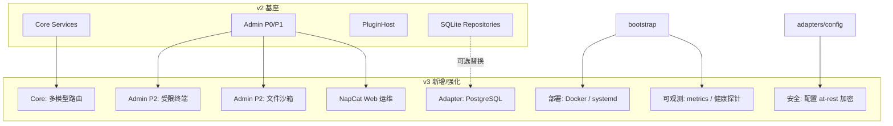
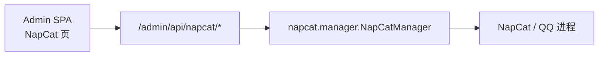

# 灵轩 v3 演进规划

> 本文为设计与计划文档，不含实现代码。基于 v2 完成态（`docs/architecture-v2.md` Phase 0–5 已落地）与近期增量（`napcat/` 裸机集成、QQ 系统消息过滤等）编写。
>
> 目标读者：项目维护者与贡献者。阅读顺序建议：先读「一、执行摘要」与「十三、开放问题」，再按需展开各 Phase。

---

## 一、执行摘要

v2 已将灵轩重构为**四层解耦的可演进单体**：Core / Protocol / Adapter / Bootstrap；存储从 JSON 迁移到 **SQLite + Alembic**；新增 **React + FastAPI 管理端**（配置、状态、日志、数据、插件、审计）与**同进程 Hook 插件系统**。近期又在 CLI 层补齐 **NapCat 裸机生命周期**（`lingxuan napcat setup|start|stop|status|logs`）与可选的 `NAPCAT_AUTO_START`。

**v3 要解决的核心问题**：在**不回退 v2 业务能力**的前提下，把系统从「能跑、能管」推进到「好部署、好运维、好扩展、可上生产」——补齐 v2 遗留的 **P2 管理面**与安全债，把 NapCat 运维从 CLI 收敛到 Web，增强部署与可观测性，并为多机/远程场景预留 **PostgreSQL** 与**多模型路由**能力。

**整体策略**：延续 v2 的绞杀者模式与依赖倒置——每个 Phase 可独立合并到 `main`，合并后现有功能仍可用；高风险能力（受限终端、文件 API）默认关闭、白名单驱动、全量审计；远期能力（RAG、插件沙箱）以 Protocol 扩展 + 可选 Adapter 交付，不做大爆炸重写。

**关键设计取向**：
- v3 **不推翻** v2 四层边界；新增能力优先落在 Adapter / Admin / Bootstrap，Core 仅在确有业务价值时扩展（如多模型路由策略）。
- 管理端 P2（终端、文件）与 NapCat Web 运维共享同一套安全基线：`DATA_ROOT` 沙箱、RBAC、审计、默认 `127.0.0.1`。
- PostgreSQL 作为**可选存储后端**，与 SQLite 共用 Repository 契约测试，不搞双写。
- 配置敏感项 at-rest 加密、登录限速等 v2 安全清单中「部分落地」项，在 v3 Phase 0 优先收口。

**工作量量级**（单人、人天量级估算，含测试）：Phase 0≈2、Phase 1≈5、Phase 2≈4、Phase 3≈4、Phase 4≈5、Phase 5≈6，合计约 **26 人天**。Phase 0–2（≈11 人天）即可达成「安全债收口 + P2 管理面 + NapCat Web 运维」这一最贴近日常使用的目标。

---

## 二、v2 完成态基线

### 2.1 已交付能力对照

| 领域 | v2 规划 | 当前状态 |
|------|---------|----------|
| 四层架构 | Protocol / Core / Adapter / Bootstrap | ✅ 已落地，`handlers/` 已移除 |
| 配置 | ConfigProvider + `config/defaults.py` 单一事实源 | ✅ 已落地，支持 DB 持久化与热更新 |
| 存储 | SQLite + Repository + Alembic | ✅ 已落地，`0001_init` |
| 数据迁移 | `migrate-memory` / `backup` / `restore` / 启动自动迁移 | ✅ 已落地 |
| 管理端 P0 | 登录、配置、状态、日志 WS | ✅ 已落地 |
| 管理端 P1 | 数据浏览/导入导出、插件管理、审计 | ✅ 已落地 |
| 插件系统 | PluginHost + Hook + `group_entities` 内置插件 | ✅ 已落地 |
| 认证安全 | JWT、RBAC、bootstrap token、登录限速、首登改密 | ✅ 已落地 |
| NapCat 集成 | v2 文档未详设 | ✅ **超前交付**：CLI + 自动启动 + 配置生成 |
| 管理端 P2 | 受限终端、文件管理 | ❌ 未实现（仅 v2 文档预留） |
| 配置 at-rest 加密 | v2 安全清单要求 | ⚠️ `SECRET_KEY` 描述提及加密，**实现未落地** |
| PostgreSQL | v2 Phase 6+ 可选 | ❌ 未实现 |
| 插件沙箱 | v2 Phase 6+ 预研 | ❌ 未实现 |
| Playwright E2E | v2 测试策略建议 | ❌ 未实现 |
| README / 运维文档 | 反映 v2 架构与 CLI | ⚠️ README 仍描述 MVP 目录结构 |

### 2.2 v2 架构不变式（v3 须遵守）

与 `docs/prompts/00-common-context.md` 一致，v3 不得破坏：

1. **Core 零框架依赖**：禁止 `nonebot` / `fastapi` / `sqlalchemy` / `openai` 等具体实现 import。
2. **依赖注入**：Core Service 经构造函数接收 Protocol 实现。
3. **存储单轨**：运行时仅以 DB 为事实源；JSON 仅用于导入/导出/备份。
4. **`.env` 向后兼容**：可 deprecate，不可无声删除既有项。
5. **QQ 管理员命令保留**：Web 管理端与 `/灵轩 ...` 共用 Core 用例。

### 2.3 当前目录结构（v2 完成态 + NapCat）

```
src/lingxuan/
├── bootstrap.py, container.py, cli.py
├── protocols/          # 抽象接口与领域类型
├── core/               # 纯业务 Service
├── adapters/           # onebot, openai, storage, logging, clock, config_provider
├── admin/              # FastAPI 子应用 + React SPA
├── plugins/            # host, loader, builtin/
├── migration/          # from_json, backup, auto
├── napcat/             # installer, manager, config（v3 需纳入正式规划）
└── config/defaults.py
```

---

## 三、v3 目标与范围

### 3.1 目标架构增量（相对 v2）



### 3.2 v3 明确不做（除非单独立项）

| 项 | 理由 |
|----|------|
| 微服务拆分 | 与单机/个人部署定位不符 |
| 远程插件市场 | 同进程无沙箱风险过高 |
| 重写 OneBot 客户端 | v2 已验证 NoneBot Adapter 边界足够 |
| 完整 RAG / 向量库产品化 | 仅 Phase 5 可选 Protocol 扩展，默认关闭 |
| Windows NapCat 一键集成 | 当前 `napcat/` 面向 Linux + Xvfb；Windows 继续文档引导 |

---

## 四、分阶段实施计划

原则：每 Phase 可独立合并；每 Phase 结束 v2 功能仍可用；高风险能力默认关闭。

| 阶段 | 目标 | 主要交付物 | 风险 | 回滚策略 | 工作量 |
|------|------|------------|------|----------|--------|
| **Phase 0** | 文档与安全债收口 | README/运维文档更新；敏感配置 at-rest 加密；安全清单自动化检查脚本；Playwright 冒烟脚手架 | 低–中：加密迁移需一次性重加密 | 加密可关（`ENCRYPT_SECRETS=false`）；文档纯增量 | ~2 |
| **Phase 1** | 管理端 P2 | 受限终端 API+WS+页面；`DATA_ROOT` 文件沙箱 API+页面；全量审计 | **高**：终端/文件是攻击面 | `ENABLE_ADMIN_TERMINAL=false`（默认）；`ENABLE_ADMIN_FILES=false`（默认） | ~5 |
| **Phase 2** | NapCat Web 运维 | 管理端 NapCat 状态/日志/启停；与 CLI 共用 `NapCatManager`；仪表盘 Bot 链路可视化 | 中：进程管理权限 | `ENABLE_NAPCAT_WEB=false`；回退 CLI | ~4 |
| **Phase 3** | 部署与可观测性 | Docker Compose；systemd unit 示例；`/admin/api/metrics`（Prometheus 文本）；结构化健康检查；日志导出 | 低 | 部署资产可选采用 | ~4 |
| **Phase 4** | PostgreSQL 适配 | `adapters/storage/postgres/`；`DB_URL` 切换；契约测试双跑；迁移指南 | 中：方言/SQL 差异 | 保留 SQLite 为默认；切回 `DB_URL` 即可 | ~5 |
| **Phase 5** | 智能增强（可选） | 多模型路由（chat/judge/summary 分流）；会话级 prompt 调试 API；记忆导出 GDPR 包 | 中：行为回归 | 路由配置回退单模型 | ~6 |
| **Phase 6+** | 远期 | 插件沙箱预研；RAG Protocol；语音/图片消息（若 OneBot 能力需要） | 高 | 各自 feature flag | 按需 |

**推荐合并顺序**：0 → 1 → 2 → 3；4、5 可按部署需求并行或延后。

---

## 五、Phase 0：文档与安全债收口

### 5.1 文档更新

| 文档 | 动作 |
|------|------|
| `README.md` | 重写「项目结构」「快速开始」：反映 v2 分层、`lingxuan` CLI、`napcat` 子命令、管理端端口、SQLite |
| `docs/napcat.md` | 补充 Linux 裸机路径（`lingxuan napcat setup`）与 Windows 手动路径对照 |
| `docs/admin.md`（新建） | 管理端首次登录、bootstrap token、反向代理、TLS 建议 |
| `docs/prompts/README.md` | 增加 v3 提示词集索引（本规划落地后拆分） |

### 5.2 敏感配置 at-rest 加密

**现状**：`settings` 表明文存 `OPENAI_API_KEY` 等；`SECRET_KEY` 仅用于 JWT。

**目标**：
- 新增 `adapters/config/encryption.py`（或合入 `config_provider`）：AES-GCM，密钥派生自 `SECRET_KEY`。
- `SettingSpec.is_secret=True` 的项写入 DB 前加密，读取时解密；`get_all(mask_secrets=True)` 行为不变。
- 一次性迁移：启动时检测明文秘密项 → 加密重写（`AUTO_ENCRYPT_SECRETS`，默认 true）。
- 新配置项：`ENCRYPT_SECRETS`（bool，默认 true）。

**验收**：
- DB 中 `OPENAI_API_KEY` 的 `value_json` 不可直接读出明文。
- 无 `SECRET_KEY` 时：管理端写秘密配置拒绝并告警（与现有一致）。

### 5.3 安全清单自动化

将 `architecture-v2.md` 第十节检查项转为 `scripts/security_checklist.py`（或 `lingxuan doctor` 子命令）：
- `SECRET_KEY` 是否设置且长度 ≥ 32
- `ADMIN_HOST` 是否为非 `0.0.0.0`（或显式 `ALLOW_PUBLIC_ADMIN=true`）
- 默认管理员是否仍 `must_change_password`
- `DATA_ROOT` 目录权限（Unix `0o700` 建议）

### 5.4 Playwright 冒烟脚手架

- 目录：`src/lingxuan/admin/web/e2e/`
- 覆盖：登录 → 改密 → 配置页保存 → 日志页 WS 收到一条 log
- CI：可选 job，`npx playwright test`；不阻塞 PR 时可 nightly

---

## 六、Phase 1：管理端 P2（受限终端与文件管理）

对齐 v2 第七节 P2 预留接口，补齐实现。

### 6.1 受限终端

**API**（v2 已草案，v3 实现）：

| 方法 | 路径 | 说明 |
|------|------|------|
| GET | `/admin/api/terminal/commands` | 列出白名单命令与说明 |
| POST | `/admin/api/terminal/exec` | 执行白名单命令（同步，超时 30s） |
| WS | `/admin/ws/terminal` | 流式执行（仅 `admin` 角色） |

**白名单设计**（默认启用集）：

```yaml
# config/terminal_whitelist.yaml（示例）
commands:
  - id: db_upgrade
    argv: ["lingxuan", "db", "upgrade"]
    cwd: "{DATA_ROOT}/.."
  - id: backup
    argv: ["lingxuan", "backup"]
  - id: status
    argv: ["lingxuan", "napcat", "status"]
  - id: tail_logs
    argv: ["tail", "-n", "200", "{NAPCAT_LOG}"]
```

**安全护栏**：
- `ENABLE_ADMIN_TERMINAL=false` 默认；启用需 `admin` + 审计。
- **禁止**任意 shell；`argv` 固定模板，仅允许占位符替换（`DATA_ROOT`、`NAPCAT_DIR`）。
- 子进程：`asyncio.create_subprocess_exec`，无 `shell=True`。
- 输出截断：stdout/stderr 各最多 64KB；超时 SIGTERM → SIGKILL。
- 并发：每用户最多 1 个活跃终端会话。

**前端**：`TerminalPage.tsx`——命令下拉 + 输出区；危险命令二次确认。

### 6.2 文件沙箱 API

| 方法 | 路径 | 说明 |
|------|------|------|
| GET | `/admin/api/files` | 列目录 `?path=` 相对 `DATA_ROOT` |
| GET | `/admin/api/files/download` | 下载文件 |
| POST | `/admin/api/files/upload` | 上传（`confirm=true`） |
| DELETE | `/admin/api/files` | 删除（`confirm=true`） |

**安全护栏**（复用 v2 第十节）：
- `realpath` 归一后必须在 `DATA_ROOT` 内；拒绝 `..`、拒绝跟随越界符号链接。
- 单文件上传上限可配置（默认 50MB）；扩展名白名单（`.json`、`.db`、`.zip`、`.log` 等）。
- `ENABLE_ADMIN_FILES=false` 默认。
- 所有写操作写 `audit_logs`。

**前端**：`FilesPage.tsx`——树形浏览、下载、上传、删除确认模态框。

### 6.3 新增配置项

| Key | 类型 | 默认 | 说明 |
|-----|------|------|------|
| `ENABLE_ADMIN_TERMINAL` | bool | false | 启用受限终端 |
| `ENABLE_ADMIN_FILES` | bool | false | 启用文件 API |
| `ADMIN_FILE_MAX_BYTES` | int | 52428800 | 上传大小上限 |
| `TERMINAL_TIMEOUT_SECONDS` | float | 30 | 命令超时 |

---

## 七、Phase 2：NapCat Web 运维

**动机**：`napcat/` 与 CLI 已能 setup/start/stop，但运维仍依赖 SSH；应在管理端统一「Bot 链路」视图。

### 7.1 架构



- **不**把 NapCat 塞进 Core；`NapCatManager` 作为 Bootstrap/Admin 层设施，经 `protocols/napcat.py`（新建轻量 Protocol）抽象，便于测试 mock。

### 7.2 API 草案

| 方法 | 路径 | 权限 | 说明 |
|------|------|------|------|
| GET | `/admin/api/napcat/status` | R | 运行状态、PID、安装路径、最近日志路径 |
| GET | `/admin/api/napcat/logs` | R | 分页/尾行日志（`?tail=200`） |
| POST | `/admin/api/napcat/start` | A | 后台启动（非前台扫码） |
| POST | `/admin/api/napcat/stop` | A | 停止 |
| WS | `/admin/ws/napcat/logs` | R | 实时 tail（类似 logs WS） |

### 7.3 仪表盘增强

`DashboardPage` 增加链路卡片：

```
[NapCat] ──WS──> [NoneBot :8080] ──> [灵轩 Core] ──> [LLM API]
   ↑                    ↑
 可启停              在线/离线
```

- Bot 在线：复用现有 `status` API 的 `bot_online`。
- LLM：复用 `POST /admin/api/status/llm-check`。

### 7.4 配置项

| Key | 类型 | 默认 | 说明 |
|-----|------|------|------|
| `ENABLE_NAPCAT_WEB` | bool | true | 管理端 NapCat API（Linux 外可自动隐藏入口） |
| `NAPCAT_LOG_TAIL_MAX` | int | 500 | API 单次返回最大行数 |

### 7.5 平台策略

- **Linux**：完整启停 + 日志。
- **Windows / macOS**：仅 status + logs（若本地有 NapCat 目录）；启停按钮隐藏，文档引导手动启动。

---

## 八、Phase 3：部署与可观测性

### 8.1 Docker Compose（推荐单机拓扑）

```yaml
# deploy/docker-compose.yml（草案）
services:
  lingxuan:
    build: .
    ports:
      - "8080:8080"   # OneBot WS
      - "8081:8081"   # Admin
    volumes:
      - ./data:/app/data
    environment:
      - SECRET_KEY=${SECRET_KEY}
      - OPENAI_API_KEY=${OPENAI_API_KEY}
    # Linux: 可选 privileged + /dev/dri 供 NapCat Xvfb
```

- 镜像多阶段构建：Python wheel + `admin/web` 前端 `npm run build`。
- `NAPCAT_AUTO_START` 在容器内默认 true（Linux）。

### 8.2 systemd

- `deploy/lingxuan.service`：`ExecStart=/usr/local/bin/lingxuan run`，`WorkingDirectory=...`，`Restart=on-failure`。
- 文档说明：先 `lingxuan napcat setup`，再 enable service。

### 8.3 Metrics 与健康探针

| 端点 | 格式 | 说明 |
|------|------|------|
| `GET /admin/api/health` | JSON | 已有 |
| `GET /admin/api/health/deep` | JSON | DB ping、迁移版本、插件加载数、NapCat 状态 |
| `GET /admin/api/metrics` | Prometheus text | `lingxuan_messages_total`、`lingxuan_llm_requests_total`、`lingxuan_observe_judge_total` 等 |

- Core 经 `protocols/metrics.py` 暴露计数器接口；Adapter 实现 no-op / prometheus 两种。
- `ENABLE_METRICS`（默认 false）；开启后仍须 JWT 或独立 `METRICS_TOKEN`（防泄露）。

### 8.4 日志导出

- `GET /admin/api/logs/export?from=&to=&level=` → `application/x-ndjson` 下载。
- 供长期归档与排障，不替代实时 WS。

---

## 九、Phase 4：PostgreSQL 适配（可选）

### 9.1 动机

SQLite 适合单机；以下场景需要 PostgreSQL：
- 管理端与 Bot 分机（远程 DB）
- 更大规模会话历史（多群高频）
- 未来只读副本 / 备份策略

### 9.2 实现策略

```
adapters/storage/
├── repositories.py      # 现有 SQLite 实现
├── postgres/
│   ├── db.py            # asyncpg 或 psycopg3
│   └── repositories.py  # 继承或组合共用 SQL 构建
└── _shared/             # 可选：共用查询助手
```

- `DB_URL=postgresql+asyncpg://...` 切换；`container.py` 按 URL scheme 选择实现。
- Alembic：同一套 revision；`env.py` 支持多 dialect（注意 SQLite/Postgres 类型差异用 `batch_alter_table` 或条件分支）。
- **契约测试**：现有 `test_*_repo_contract.py` 对 SQLite 与 Postgres 各跑一遍（CI 用 service container）。

### 9.3 不做

- 运行时 SQLite ↔ Postgres 双写。
- 自动在线迁移工具（v3 仅文档 + `pg_dump`/备份恢复指南）。

---

## 十、Phase 5：智能增强（可选）

### 10.1 多模型路由

**动机**：judge 可用更小/更快模型；摘要用中等模型；主对话用大模型。

| 配置键 | 说明 |
|--------|------|
| `OPENAI_MODEL_JUDGE` | 空则回退 `OPENAI_MODEL` |
| `OPENAI_MODEL_SUMMARY` | 空则回退 `OPENAI_MODEL` |
| `OPENAI_BASE_URL_JUDGE` | 可选独立 endpoint |

- 实现：`core/routing.py` 纯函数 `resolve_model(purpose: Literal["chat","judge","summary"])` + `ConfigProvider`。
- `LLMProvider` 接口不变；OpenAI Adapter 按解析后的 model 调用。

### 10.2 Prompt 调试 API（管理端）

| 方法 | 路径 | 说明 |
|------|------|------|
| POST | `/admin/api/debug/preview-prompt` | 给定 session_id + 模拟入站消息，返回将送入 LLM 的 messages（**不调用 LLM**） |
| POST | `/admin/api/debug/observe-trace` | 给定群 + 文本，返回观察短路/judge 决策链（`reason` 字段） |

- 仅 `admin`；全量审计；禁止泄露其他用户敏感上下文到 readonly 角色。

### 10.3 记忆 GDPR 导出

- `GET /admin/api/users/{uid}/export-package` → zip：profile、facts、相关 sessions 片段。
- 对齐隐私文档「导出我的数据」承诺。

### 10.4 RAG（远期 Protocol 仅定义）

```python
class RetrievalProvider(Protocol):
    async def search(self, query: str, *, user_id: int | None, limit: int = 5) -> list[RetrievalChunk]: ...
```

- 默认空实现；不在 v3 强交付。

---

## 十一、Phase 6+ 远期

| 主题 | 内容 |
|------|------|
| 插件沙箱 | 子进程 Hook 代理、资源限额；或 WASM 预研文档 |
| 消息类型扩展 | 图片/语音/戳一戳的 InboundMessage 字段扩展与 Adapter 映射 |
| 多 Bot 实例 | 单进程多 `MessageTransport`（低优先级） |
| 社区插件模板 | `cookiecutter-lingxuan-plugin` |

---

## 十二、测试策略（v3 增量）

| 层 | v3 新增测试 |
|----|-------------|
| Admin API | 终端白名单拒绝注入；文件 API `..` 穿越；NapCat API mock 进程 |
| Security | 加密往返；`doctor` 检查项快照 |
| Storage | Postgres 契约测试（CI service） |
| E2E | Playwright 登录/配置/日志；可选 NapCat 页 mock |
| Core | 多模型路由纯函数单测；observe-trace 决策矩阵 |

覆盖率门槛：维持 v2 标准（Core + storage 契约优先）。

---

## 十三、开放问题（待维护者决策）

1. **Phase 1 默认是否开启 P2 能力**  
   - 推荐：**默认关闭**（`ENABLE_ADMIN_*=false`），生产需显式开启。  
   - 备选：开发镜像默认开启，生产 Compose 覆盖为 false。

2. **NapCat 前台扫码登录是否进 Web**  
   - 推荐：**不进 Web**（二维码泄露风险）；Web 仅后台启停 + 日志；首次扫码继续 `lingxuan napcat start` 前台。  
   - 备选：WebSocket 推送二维码（只读角色可看）——需评估 shoulder surfing。

3. **PostgreSQL 是否进入 v3 必做**  
   - 推荐：**Phase 4 可选**，SQLite 仍为默认。  
   - 备选：若目标用户含「云服务器远程部署」，提升至 Phase 3 并行。

4. **Metrics 认证方式**  
   - 推荐：独立 `METRICS_TOKEN` header，与 JWT 分离。  
   - 备选：仅绑定 `127.0.0.1` 免认证（依赖网络隔离）。

5. **多模型路由是否默认分流**  
   - 推荐：默认全用 `OPENAI_MODEL`，分流项为空=回退。  
   - 备选：文档推荐 judge 默认 `deepseek-chat` + summary 小模型（增加配置复杂度）。

---

## 十四、v3 编码提示词拆分建议

落地时可按 v2 模式在 `docs/prompts-v3/` 拆任务（待 Phase 启动时编写）：

| 目录 | 任务示例 |
|------|----------|
| `phase0/` | P0-01 敏感配置加密；P0-02 README 重写；P0-03 doctor 命令；P0-04 Playwright 脚手架 |
| `phase1/` | P1-01 terminal API；P1-02 files API；P1-03 TerminalPage；P1-04 FilesPage |
| `phase2/` | P2-01 napcat protocol；P2-02 napcat routes；P2-03 NapCatPage；P2-04 dashboard 链路 |
| `phase3/` | P3-01 Dockerfile；P3-02 compose；P3-03 metrics；P3-04 deep health |
| `phase4/` | P4-01 postgres db；P4-02 postgres repos；P4-03 alembic multi-dialect |
| `phase5/` | P5-01 model routing；P5-02 debug API；P5-03 GDPR export |

---

## 附录 A：与 v2 文档的对应关系

| v2 章节 | v3 承接 |
|---------|---------|
| 第七节 P2 API | Phase 1 完整实现 |
| 第十节安全清单 | Phase 0 加密 + doctor |
| 第十一节 Phase 6+ | Phase 4–6+ 展开 |
| 第十三节 E2E | Phase 0 Playwright |

## 附录 B：兼容性承诺

- v2 全部业务能力（私聊、群聊、观察、记忆、插件、管理端 P0/P1、CLI）在 v3 各 Phase **不回退**。
- 新增配置项均有默认值；P2 能力默认 **关闭**。
- `napcat/` CLI 行为保持；Web 层为增量。

---

*文档版本：2026-07-08 · 基于仓库 `main` 在 v2 Phase 0–5 完成态上的规划*
